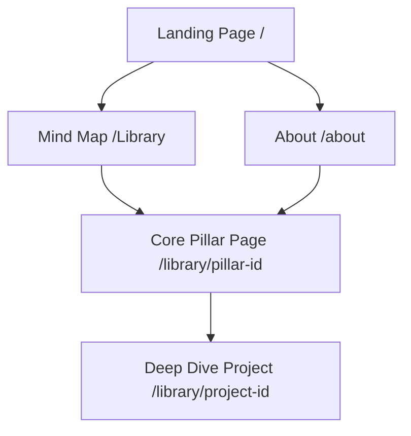

# Portfolio Site Structure & Flow

This document outlines the architecture for Ajay Rajnikanth's personal portfolio, focusing on a systems-driven narrative that consolidates 51+ experiences into core professional pillars.

## 1. User Journey & Flow

1.  **Entry (Landing):** High-level identity (Strategy X Technology). Call to action leads directly into the "Mind Map."
2.  **Exploration (Library/Map):** The central hub. Users see connections between diverse fields (Fintech, Medical Research, Leadership).
3.  **Thematic Pillar:** Clicking a node leads to a "Pillar Page" (e.g., "The Fintech & Market Systems Pillar") which lists all consolidated sub-projects.
4.  **Deep Dive:** For major projects (like Carotid Artery Research), users can click through to a dedicated detail page.

---

## 2. Page Directory & URLs

| Page | URL | Purpose |
| :--- | :--- | :--- |
| **Home** | `/` | Identity, taglines, and immediate funnel to the Work. |
| **Mind Map** | `/library` | Interactive D3/Canvas graph linking all professional nodes. |
| **About/Systems** | `/about` | Professional philosophy, timeline, and academic background (Consolidating Dean's List, Honors, etc.). |
| **Pillar/Project** | `/library/[id]` | Case studies or consolidated pillar pages. |
| **Contact** | `/contact` | Quick contact form or direct links. |

---

## 3. High-Level Content Organization

Instead of a flat list of 51 items, the content is organized into a **Hierarchy of Significance**.

### A. The Core Pillars (Permanent Library Nodes)
These are the primary entry points in your Mind Map:
*   **Fintech & Market Systems:** (Items 1, 2, 3, 22, 23, 27)
*   **Medical Computing (Bio-Systems):** (Items 5, 6, 7, 48)
*   **Operational Design & Automation:** (Items 30, 31, 40, 44, 45)
*   **Strategic Leadership & Governance:** (Items 16, 20, 24, 43, 47)

### B. The "Milestones" (Timeline/About Content)
These are not standalone pages but are integrated into the `/about` timeline or as "badges" on Pillar pages:
*   **Academic Honors:** (Items 13, 15, 17)
*   **Scholarships:** (Items 9, 11)
*   **Early Career:** (Item 10, 14, 21)

### C. The "Archive" (Secondary Content)
A simple list or accordion section for high-volume items that show "grit" but don't need spotlighting:
*   **The Hackathon Log:** (Items 51 - list of 50+ event names).
*   **Extracurriculars:** (Items 41, 49).

---

## 4. Visual Layout (Design Guidelines)

*   **Typography:** Strict use of **IBM Plex Mono** (Code/Labels) and **IBM Plex Sans** (Titles/Body).
*   **Color Palette:** Dark-themed background (`#0A0A0A`) with accent glows (`#A48A72`) to represent different knowledge clusters.
*   **Navigation:**
    *   **Top Nav:** Minimal. Home | Work | About | Contact.
    *   **Contextual Nav:** Within the Graph, a "Reset View" or "Filter" toggle.
*   **Transitions:** Fade-in-up animations for content sections. Smooth SVG path transitions for graph links.

---

## 5. Next Steps
*   [ ] Finalize the mapping of all 51 items to these specific Pillars.
*   [ ] Draft introductory text for the 4 Core Pillars.
*   [ ] Decide which 3 projects get a "Deep Dive" detail page.
